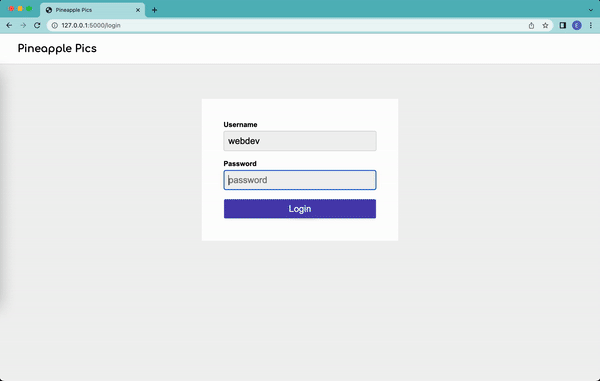

## Welcome to Pineapple Pics!

This is a full stack Instagram clone I developed throughout the duration of my CS396 web development class at Northwestern.

The branch structure is as follows:
* **Main**: Client side react.js that dynamically renders from backend web server (like Flask server in HW05)
* **HW01**: Static site template with HTML/CSS
* **HW02**: Dynamically generated site with Flask and Jinja server-side templates
* **HW03**: Added REST API endpoints on the web server instead of direct access
* **HW04**: Client-sided templating with vanilla Javascript en lieu of the sever-sided templating from previous branches
* **HW05**: Added user authentication with JSON web tokens and cookies

---

Final site demo!

 
